# Composite EMAC

The original Mbed OS Ethernet driver (aka EMAC driver) API was added in Mbed OS 5.9. That API grouped all Ethernet MAC functionality into a single abstract class that targets/vendors had to implement, the `EMAC` class. Since then, dozens of Mbed targets have received EMAC drivers, and the strengths and weaknesses of this API have become clear. The general structure is good, and the idea of abstracting the memory manager and the network stack from the EMAC driver works well.

However, the [EMAC interface](https://github.com/mbed-ce/mbed-os/blob/0553c111850997d847dc6a3189ac0b7048304e57/connectivity/netsocket/include/netsocket/EMAC.h#L33) is difficult to implement, especially for people not intimately familiar with Mbed and its IP stacks. It requires EMAC implementations to implement the specifics of memory management, MAC address tracking, and DMA ring usage themselves, even though quite a bit of this logic is common to all MAC drivers. This has led to duplicated code, and quite often to half-assed code as well as chip vendors have struggled to conform to the (in some ways not very well defined) EMAC API. 

Couple that with inconsistent testing, and you have a recipe for inconsistent and buggy Ethernet drivers across the breadth of Mbed devices. For instance, Mbed supports zero-copy EMACs, where buffers can be passed directly to and from the Ethernet peripheral without being copied. This saves both memory and CPU time. However, this was only ever implemented for a few targets, because it's very difficult to get right. Even more egregiously, the EMAC driver implemented for STM32H7 for the past 6+ years has ignored the memory manager API and used LwIP directly, making it impossible to even test it with the EMAC tests (and hoo boy, were there a lot of things that would have failed). For extra fun, this driver also ignored the DMA functionality and sent packets _synchronously_, meaning the application is blocked while a packet is being transmitted!

To address this situation, Mbed CE is implementing a new layer in the EMAC driver stack: CompositeEMAC. CompositeEMAC is a class which implements the `EMAC` API and breaks up the functionality into several subclasses.


By implementing these four subclasses for each target MCU and board, high-performance Ethernet can be ported to any Mbed target much more easily than before.

## Embedded Ethernet - An Overview

Before we can get into the details of how CompositeEMAC works, we need to go over how embedded Ethernet works in general.

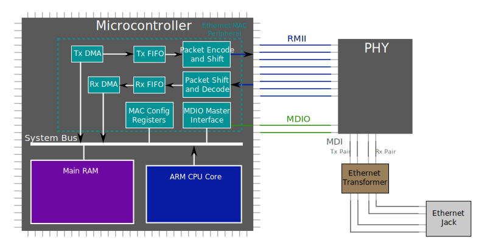

To run an ethernet connection, two chips need to work together*: the microcontroller and an external Ethernet PHY (PHYsical layer transceiver) chip. The microcontroller sends and receives logic level Ethernet packets, while the PHY transforms those into Ethernet signals, which are decidedly *not* logic level (and actually have a lot in common with radio signals). The Ethernet signals, called MDI (Media Dependent Interface) pairs, are sent through an isolation transformer, which removes common mode interference and provides electrical isolation (e.g. so that the two ends of the connection can have different ground voltage levels). Then, they go into the ethernet jack and across the ethernet cable to the link partner!

*though some MCUs, e.g. TI's TM4C129 line, do have the Ethernet PHY integrated into the MCU.

The PHY and the MCU are connected via a standard called [Reduced Media Independent Interface](https://en.wikipedia.org/wiki/Media-independent_interface#RMII) (RMII), which transfers the Ethernet packets as serialized bytes. This is an 8-wire bus with a 50MHz clock, four receive lines, and three transmit lines. The clock is traditionally either supplied by the PHY or by a dedicated clock generator chip, though some MCUs support supplying this clock as well. In addition to RMII, there's also a two-wire command and control bus called [Management Data IO](https://en.wikipedia.org/wiki/Management_Data_Input/Output) (MDIO) (though it can also be referred to Station Management Interface (SMI) or even "MiiM" for some reason). MDIO is used for talking directly to the PHY, not for sending Ethernet packets. MDIO is an open-drain bus similar to I2C, but with 16-bit words instead of bytes and a specific frame format (referred to as "Clause 22"). Unlike RMII, MDIO is a multi-drop bus, so you can actually connect up to 15 PHYs or other devices to one set of MDIO lines as long as they have different addresses!

Inside the microcontroller, the bridge between the CPU and Ethernet is a peripheral called the Ethernet MAC. MAC stands for "Media Access Control" and refers to the second layer of the Ethernet protocol stack, the logic which encodes Ethernet packets and decides when to send them across the wire. The MAC has a number of moving parts inside, which are shown in the diagram above. The simplest is the block of configuration registers, which is accessible at a specific memory address and sets up operation of the MAC (e.g. what MAC addresses the hardware should accept and which checksums should be inserted/checked by the MAC). There is also an MDIO master interface, which controls the MDIO lines to talk to the PHY. And then, we have the DMA.

Every Ethernet MAC I've seen also has DMA functionality. This means that the Ethernet peripheral can transmit and receive packets without direct CPU intervention. This is very important because it means your device can hit high network speeds without needing to have your CPU blocked for lots of time waiting on Ethernet packets to move through the hardware! For transmit, there will be a Tx DMA module which fetches data from the main RAM, and then enqueues the packet bytes plus control information into a FIFO (which is usually at least a couple thousand bytes long). Then, another block in the MAC operating on its own timing, sometimes called the MTL (MAC Translation Layer) takes these bytes, applies any needed Ethernet framing, and shifts them out of the RMII Tx port.

For reception, the process works the same but in reverse: the decoder and shifter block takes in packets and enqueues their bytes into the Rx FIFO. Then, the Rx DMA dequeues the packets and stores them into RAM at the right location.

How does the DMA know where in RAM to read and write packets, though? On every embedded MAC I have seen so far, this is done through a ring of "DMA descriptors". Here's a diagram (that I stole from the STM32F2 datasheet):


A descriptor is a structure in memory that contains control information and one or more pointers to memory buffers (which contain the actual packet data). For Tx, the DMA will fetch the descriptor, then transmit the data in the buffers. For Rx, the DMA will fetch the descriptor, then write the packet to the descriptor's buffers. Either way, when the MAC is done with the descriptor, the DMA will write back status information (e.g. whether the checksum passed, or what timestamp the packet was sent at) to the descriptor, set a "done" flag, and then interrupt the CPU to tell it it has something to process.

But we don't want the DMA to have to wait for the CPU, do we? To avoid this, each descriptor also specifies a "next descriptor", either via an offset or a pointer. The DMA can move to this next descriptor and start processing it right away to send or receive the next packet. The CPU will process the completed descriptor on its own time and give it back to the DMA. In this manner, as long as your ring of descriptors is big enough and your CPU can keep up with the processing them, the CPU and MAC never have to wait for each other!

## Components of the Composite EMAC
Now that we've covered how an EMAC works in hardware, we can talk through how CompositeEMAC works, and what needs to be implemented for each MCU target.

### MAC Driver

The MAC driver (which must be implemented as a subclass of `CompositeEMAC::MACDriver`) is usually fairly simple. It provides an interface between Mbed and the MAC's configuration register block and MDIO master interface. Its responsibilities include:
- Initializing and muxing the RMII and MDIO pins
- Initializing all needed clocks
- Configuring all settings needed for MAC operation
- Configuring the unicast MAC address (as in, the MAC address that the device uses on the network)
- Adding and removing multicast subscriptions
- Configuring interrupts
- Talking to the PHY over MDIO

### PHY Driver

The PHY driver must be a subclass of `CompositeEMAC::PHYDriver`. It must:
- Confirm the existence of the PHY chip and initialize it
- Configure the selected Ethernet settings (autonegotiation, speed, duplex) into the PHY
- Check if link has been established and, if so, what kind

Unlike the MAC driver and the DMA, the PHY driver does not need to be subclassed for each target device. Thankfully, the Ethernet standard imposes some order on the chaotic sea of PHY parts, and it mandates that the lower 16 registers are standardized and must work the same way on each part. Using this standard behavior, we have implemented the `mbed::GenericEthPhy` class, which should function as a driver for any 802.3u standard compliant PHY. All it needs is configuration, like the PHY's part number and its address on the MDIO bus. When porting to a new target, all you need to do is indicate the PHY model in `mbed-os/connectivity/netsocket/mbed_lib.json` like so:

```json5
"MY_TARGET": {
    "nsapi.emac-phy-model": "LAN8742",
    "nsapi.emac-phy-mdio-address": 0
}
```

This will work out of the box, as long as `LAN8742` names a PHY driver defined in PhyDrivers.cpp. Individual PHY models will generally need their own drivers, since often PHYs have errata that need to be worked around or need other configuration that isn't defined in the standard. However, GenericEthPhy allows implementing the absolute minimum amount of logic per-phy as possible!

Since user boards may want to use a different ethernet PHY, the driver can be customized in an application by overriding the `mbed::get_eth_phy_driver` weak function to return a different driver class. This might look something like

```c++
namespace MY_PHY {
inline constexpr GenericEthPhy::Config Config = {
    // These are found in the PHY datasheet. See GenericEthPhy::Config for documentation.
    .OUI = 0x123,
    .model = 0x45,
    .address = 0,
};

class Driver : public GenericEthPhy {
public:
    explicit Driver(GenericEthPhy::Config const & config = DefaultConfig):
    GenericEthPhy(config)
    {}
    
    // You may override/replace any functions of `GenericEthPhy` here
};
}

namespace mbed {
CompositeEMAC::PHYDriver * get_eth_phy_driver()
{
    static MY_PHY::Driver(MY_PHY::Config) phyDriver;
    return &phyDriver;
}
}
```

### Tx DMA

The Rx and Tx DMAs are implemented as their own driver classes, instead of in the MAC driver, as they are somewhat complicated and generally don't interact with the other pieces of the EMAC very much. To work with CompositeEMAC, the Tx DMA must be implemented as a subclass of `CompositeEMAC::TxDMA`. However, since the large majority of microcontrollers implement Tx DMA in a very similar way, the `GenericTxDMARing` class has been provided which provides most of the needed functionality.

#### Generic Tx DMA Ring Operation

`GenericTxDMARing` assumes the basics: there is a ring of descriptors which are processed in sequence. The Ethernet DMA may transmit a packet once it is marked as "owned by DMA" in the ring (usually via a bitfield in the descriptor). Once the packet is done transmitting, the Ethernet DMA gives it back to the application by clearing the own flag and delivering an interrupt.

Mbed's generic Tx DMA ring driver uses two indexes to manage the ring of descriptors: `txSendIndex`, the index of the next Tx descriptor that can be filled with data, and `txReclaimIndex`, the index of the next descriptor that can be reclaimed by the driver. Together, these indexes, plus a count variable, describe the state of the descriptor ring.

To explain how this works, let's go through an example of transmitting some packets via the descriptors.

##### Initial State
When the driver starts, both indexes point to descriptor 0. No data is in the DMA ring.

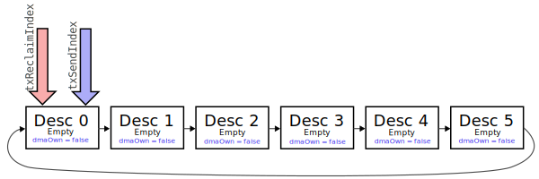


##### Packet 0 Enqueued
Now suppose we enqueue a packet to be transmitted into the ring. The packet will go into desc 0, since that is where `txSendIndex` is pointing. The driver will give desc 0 to the DMA, so it will start being transmitted out of the Ethernet port.

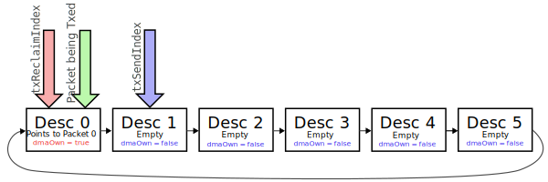

##### Packet 1 Enqueued
Now, very soon after the first packet, we enqueue another packet to be transmitted. This packet is split between two buffers (common when using zero-copy transmission), so it takes up two descriptors. These two descriptors are then given to the DMA to send.

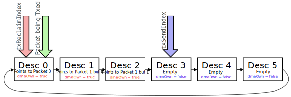

##### Packet 0 Completes
Soon after, the MAC completes the transmission of packet 0. It sets the DMA own flag in the descriptor back to false, and delivers a Tx interrupt to the application. The below picture shows the state of the descriptors when the interrupt fires.

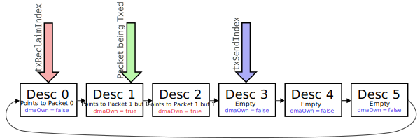

##### After Packet 0 Tx Interrupt
The Tx interrupt* will detect that the descriptor pointed to by `txReclaimIndex` has completed. It can then deallocate the memory for Packet 0, collect any needed status information (e.g. the timestamp) from the descriptor, and advance `txReclaimIndex` forward. Last but not least, it sets a thread flag to unblock any threads which are waiting for a Tx descriptor in order to send a packet.

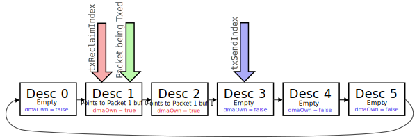

*Actually, interrupts cannot deallocate memory in Mbed, so the Tx interrupt handler actually signals the MAC thread to wake up and process the completed descriptor.

##### Final State
Eventually, after a couple hundred microseconds, the second packet will be transmitted, and its descriptors will also be reclaimed. The Tx descriptor ring is now empty, and matches the initial state except that the descriptor pointers are now both pointing to Desc 3.

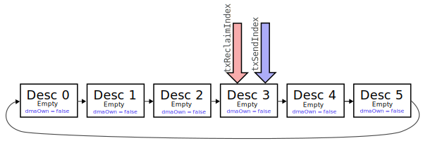

Note that in most cases, once the ring is empty like this, the Tx DMA in the hardware will simply sit and wait until dmaOwn is set on Desc 3. However, this depends a bit on the hardware -- some MACs need an additional "poke" command to make them recheck the descriptor, and yet others simply need to be told which descriptor address to transmit once a new one is made available.

##### Descriptor Exhaustion
You might notice a slight problem with the send and reclaim indexes, as described so far. When the Tx descriptor ring is totally full, they both end up pointing to the same descriptor:

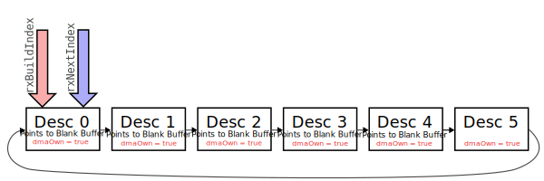

This is a problem because, earlier, we said that the initial state of the DMA ring, with no packets enqueued, also has both indices pointing to the same descriptor. This might cause us to naively calculate that the descriptor ring is empty! 

This is a classic problem with circular FIFOs, and to solve it, we go for the classic solution. An additional count variable, `txDescsOwnedByApplication`, counts how many descriptors are known to be NOT owned by DMA. It's decremented each time we give a descriptor to DMA, and incremented each time we reclaim one back. We can then use this count variable to dis-ambiguate the situation where `txSendIndex == txReclaimIndex`.

#### Target-Specific Tx DMA Implementation

For each target, the `GenericTxDMARing` class needs to be extended. The subclass must provide a couple functions:

- Allocating the actual DMA descriptors (since this often has special requirements on alignment or memory banks)
- Initializing and deinitializing the Tx DMA
- Checking the dmaOwn flag on a descriptor
- Checking if a given buffer address is accessible by the DMA controller (since, on many MCUs, certain areas of memory are not OK and the buffer will need to be copied)
- Giving a descriptor to DMA after populating it with a given buffer

Everything else, including the descriptor tracking and memory management, is done by the superclass. This should let target implementations focus only on the low level descriptor format while relying on common code for everything else.

### Rx DMA

The Rx DMA works similarly to the Tx DMA. To instantiate a `CompositeEMAC`, you must provide an instance of `CompositeEMAC::RxDMA`. Mbed provides a generic superclass (`GenericRxDMARing`) which implements most of TxDMA, but must be extended for each target to add the last pieces of functionality.

#### Generic Rx DMA Ring Operation

Like the Tx DMA, the Rx DMA works using a descriptor ring and two indexes that track where we are in the descriptor ring. `rxNextIndex` tracks the next descriptor index that we expect the Ethernet DMA to receive into, while `rxBuildIndex` tracks the next descriptor that we are going to give back to the DMA when possible.

##### Initial State

Unlike the Tx DMA, the initial state of the Rx DMA ring is for all the descriptors to be given to DMA and have their buffer pointers populated with blank network stack buffers. This makes them all available for the MAC to receive into.

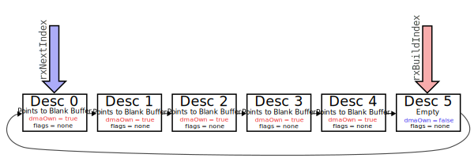

Note that, for now, we always leave one un-filled descriptor in the ring. This is needed because certain target ethernet MACs (e.g. STM32 Eth IP v2) cannot have every Rx descriptor enqueued at the same time or they get confused and think there are *no* Rx descs enqueued! So, for now, we always need to have one extra Rx desc in the ring.

##### After Packet Rx

Let's now see what it looks like after we receive a large Ethernet packet (1500 bytes). With the default setting for `nsapi.emac-rx-pool-buf-size`, each of the blank buffers is 592 bytes, so packets <= 592 bytes only need one buffer, while a 1500 byte packet needs three buffers.

Slight tangent: We could set `nsapi.emac-rx-pool-buf-size` to >=1500 bytes so that each packet always fits in one descriptor, and this would make receiving large packets more efficient (in terms of CPU and descriptors used). However, this would mean we would need ~3x the RAM to allocate our 6 descriptor ring, and that extra RAM is wasted when we receive a small packet that only needs a fraction of that 1500 byte buffer. So, this setting is a tradeoff, and may be customized if you know you are dealing with only small or only large packets.  

Anyway, when the packet is received, the MAC will write it into the next three available descriptors, then clear the own flags and mark which descriptors contain the start and end of the packet. Then, it delievers an Rx ISR to the driver. This is the state of the DMA ring when the Rx ISR fires:

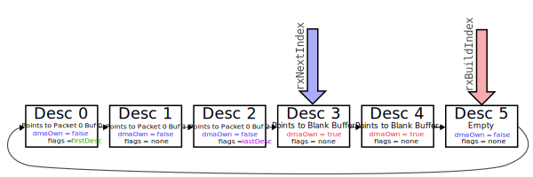

##### Packet Dequeued

The Rx ISR checks the DMA ring to make sure we have at least one complete packet. Then, it signals the MAC thread to dequeue the packet and pass it off to the IP stack.

When the packet is dequeued, the buffers will be removed from the descriptors and, for now, the descriptors stay in the "owned by application" region of the descriptor ring (between `rxNextIndex` and `rxBuildIndex`).

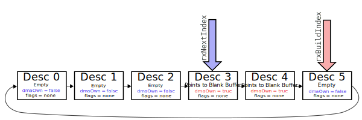

##### Descriptors Rebuilt

The final step is to "rebuild" the descriptors, which means attaching a fresh buffer* to them and giving them back to the DMA. This is done by the `rebuildDescriptors()` function, and basically keeps rebuilding descriptors until `rxBuildIndex` is one behind `rxNextIndex`, or until we run out of memory in the Rx memory pool. 

Ideally, we will immediately rebuild all the descriptors right after dequeuing the packet. However, if we don't have enough memory, we will rebuild the descs later when we do. 

Once the descriptors have been rebuilt, we will basically be back in the initial state, except moved three descriptors along the Rx ring.

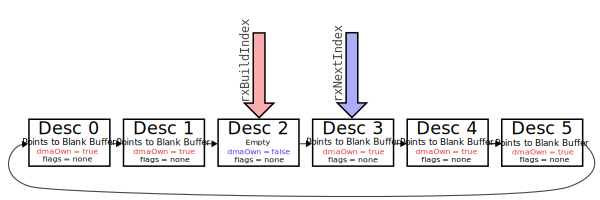

*In most EMAC drivers, you would just copy the Rx packet out of the DMA buffer, then re-enqueue the descriptor without changing the buffer. However, since this is a zero-copy EMAC, we give the original DMA buffer to the network stack, so we then need to get a fresh buffer before we can re-enqueue the descriptor. 

##### Memory Exhaustion

Running out of Rx pool memory is a problem for zero-copy Rx drivers in particular -- if the driver cannot rebuild an Rx descriptor when a packet is dequeued, it has to rebuild it at some later date. If this never happens, no reception can occur.

Until CompositeEMAC was added, Mbed didn't have a good way to solve this problem. Some zero-copy drivers (e.g. LPC1768) would at least try and rebuild unbuilt descriptors the next time a packet was received, but none of them could handle the case where all Rx memory was exhausted -- there would be no built descriptors in the ring, so no packets could be received, and the MAC would be stuck forever.

To solve this problem, the CompositeEMAC PR series added a new hook in both of the IP stacks for when a pool buffer is deallocated. This then triggers a callback to the memory manager, then to the MAC. This way, the MAC will know when Rx memory is available again and can unstick itself!

#### Target-Specific Rx DMA Implementation

For each target, the `GenericRxDMARing` class needs to be extended. The subclass must provide a couple functions:

- Allocating the actual DMA descriptors (since this often has special requirements on alignment or memory banks)
- Initializing and deinitializing the Rx DMA
- Checking the dmaOwn flag on a descriptor
- Checking the flags (first, last, error) on a descriptor
- Getting the total length of a packet received into a series of descriptors
- Returning a rebuilt descriptor to the DMA controller, with a given buffer address

Everything else, including the descriptor tracking and memory management, is done by the superclass. This should let target implementations focus only on the low level descriptor format while relying on common code for everything else.
